# SVG ARCHIVE

## basic

### rect

### partial-rect

### rounded-rect

### square

### circle

### ellipse

### diamond

### process

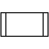

### parallelogram

### triangle

### orthogonal-triangle

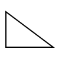

### acute-triangle

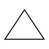

### hexagon

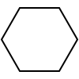

### polygon

### trapezoid

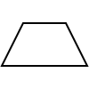

### step

### cylinder

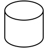

### cone

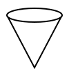

### fan

### ring-fan

### cursor

### data-storage

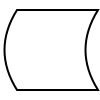

### pentagon

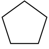

### star

### cloud

### cross

### corner

### pill

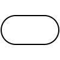

### line

### dotted-line

### dashed-line

## flowchart

### start-or-end

### document

### tape

### internal-storage

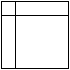

### tape-data

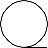

### manual-input

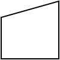

### loop-limit

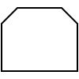

### off-page-connector

### delay

### display

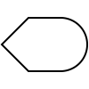

### or

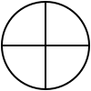

### sum

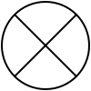

### sort

### card

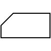

### annotation-left

### annotation-right

### comment-left

### comment-right

## arrow

### left-arrow

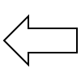

### right-arrow

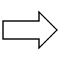

### up-arrow

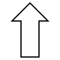

### down-arrow

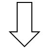

### left-right-arrow

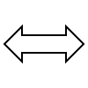

### up-down-arrow

### back-arrow1

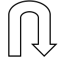

### back-arrow2

## grid

### dot

### mesh

