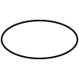
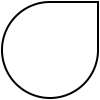
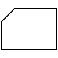
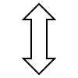
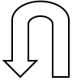

# SVG ARCHIVE

## basic

### rect

### partial-rect

### rounded-rect

### square

### circle

### ellipse

### diamond

### process

### parallelogram

### triangle

### orthogonal-triangle

### acute-triangle

### hexagon

### polygon

### trapezoid

### step

### cylinder

### cone

### fan

### ring-fan

### cursor

### data-storage

### pentagon

### star

### cloud

### cross

### corner

### pill

### line

### dotted-line

### dashed-line

## flowchart

### start-or-end

### document

### tape

### internal-storage

### tape-data

### manual-input

### loop-limit

### off-page-connector

### delay

### display

### or

### sum

### sort

### card

### annotation-left

### annotation-right

### comment-left

### comment-right

## arrow

### left-arrow

### right-arrow

### up-arrow

### down-arrow

### left-right-arrow

### up-down-arrow

### back-arrow1

### back-arrow2

## grid

### dot

### mesh

